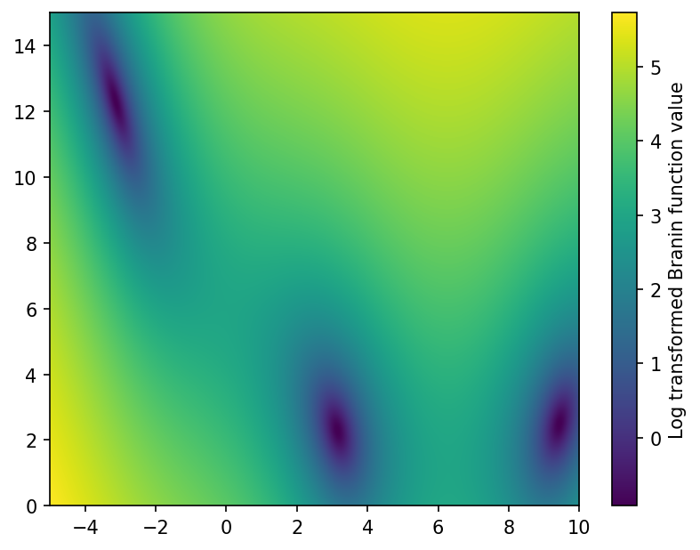

# bayesian-optimization-hpo-suite
Gaussian process surrogate modeling and Bayesian optimization for Branin and hyperparameter tuning of SVM and online LDA.

# Data Visualization

The Branin function appears nonstationary: the scale and mean level of the function vary considerably across the domain. It shows 3 global minima.

We could make the function behave in a stationary manner by applying a logarithmic transformation. Taking the inverse is also a viable approach but would make further analysis through Gaussian Processes rather awkward.

 ## SVM and LDA (from [here](https://github.com/mwhoffman/benchfunk?tab=BSD-2-Clause-1-ov-file#readme))

 The \[online\] Latent Dirichlet Allocation (LDA) and Support Vector Machine (SVM) .csv files are are comprised of 3 dimensional hyperparameter spaces with precomputed objective values. They serve as benchmarks in place of running actual highly expensive experiments.

 From the plots of these values we can see: 

 LDA yields a strongly right-skewed distribution where most hyperparameters return moderate objective values. The distribution is non-gaussian with a long tail. A transformation that stabilizes the variance is necessary

 The SVM has a much sharper peak, with a long right tail. It appears as more concentranted but is still skewed.